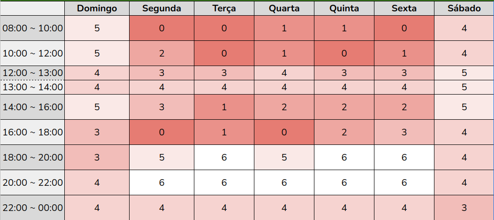

# Cronograma

## 1. Objetivo

O objetivo do cronograma do projeto é prover uma visualização rápida da divisão cronológica do semestre conforme especificado no plano de ensino. As tabelas de atividades listam as principais tarefas que foram realizadas durante uma sprint. Cada Sprint está relacionada com uma entrega da disciplina e também a gravação de uma apresentação.

## 2. Cronograma do projeto

| Sprint | Descrição       | Data                                           | Apresentação        |
| :------: | :----------: | :---------------------------------------------------: | :------------: |
| I    | Planejamento do Projeto e Processo de Design | 01/02 ~ 13/02 | 17/02 |
| II    | Perfil do usuário, Personas e Análise de tarefas | 14/02 ~ 27/02 | 03/03 |
| III    | Princípios Gerais de Projeto, Metas de usabilidade, Guia de Estilo | 28/02 ~ 12/03 | 15/03 |
| IV    | Planejamento da Avaliação do Storyboard e Análise de tarefas | 13/03 ~ 16/03 | 17/03 |
| V    | Resultados do Story Board e da Análise de tarefas, Planejamento do Protótipo de Papel | 17/03 ~ 30/03 | 31/03  |
| VI    | Verificação dos artefatos | 31/03 ~ 06/04 | 07/04 |
| VII    | Relato dos resultados do Protótipo de Papel, o Planejamento do protótipo de alta fidelidade | 07/04 ~ 11/04 | 12/04 |
| VIII    | Projeto final | 12/04 ~ 25/04 | 26/04 ~ 28/04 |

  Tabela 1 - Cronograma do projeto

## 3. Tabelas de tarefas 

### 3.1 Sprint 1    -   Planejamento e Processo

| Tarefas         | Responsável | Revisor   | Entrega Limite |
| :-----:         | :---------: | :-----:   | :--------------: |
| Implementação do GitHub Pages    | [Rodrigo Carvalho](https://github.com/Rocsantos)	    | [Eliseu Kadesh](https://github.com/eliseukadesh67)    | 11/02            |
| Descrição dos processos de design | [Erick Levy](https://github.com/ErickLevy)	      | [Erick Levy](https://github.com/ErickLevy)      | 11/02            |
| Descrição das metodologias | [Eliseu Kadesh](https://github.com/eliseukadesh67)      | [Antonio Igor](https://github.com/antonioigorcarvalho)   | 11/02            |
| Criação do Cronograma | [Antonio Igor](https://github.com/antonioigorcarvalho)     | [Valderson Pontes](https://github.com/valdersonjr) | 11/02            |
| Criação das Ferramentas | [Douglas Monteles](https://github.com/DouglasMonteles)     | [Rodrigo Carvalho](https://github.com/Rocsantos) | 11/02            |
| Organização dos planejamentos de avaliação dos membros | [Valderson Pontes](https://github.com/valdersonjr)| [Rodrigo Carvalho](https://github.com/Rocsantos)   | 11/02            |
| Gravação da apresentação 1  | Todos       | Todos     | 13/02            |

  Tabela 2 - Referente as Tarefas da Sprint 1 

### 3.2 Sprint 2   -  Análise de tarefas , Análise hierárquica , Perfil de usuário e Personas

| Tarefas         | Responsável | Revisor   | Entrega Limite |
| :-----:         | :---------: | :-----:   | :--------------: |
| Criação do documento de personas  | [Antonio Igor](https://github.com/antonioigorcarvalho) e [Valderson Pontes](https://github.com/valdersonjr) | [Douglas Monteles](https://github.com/douglasmonteles), [Erick Levy](https://github.com/ericklevy) e [Eliseu Kadesh](https://github.com/eliseukadesh67)    | 25/02 |
| Criação do documento de Análise de tarefas  | [Eliseu Kadesh](https://github.com/eliseukadesh67) e [Rodrigo Carvalho](https://github.com/Rocsantos) | [Antonio Igor](https://github.com/antonioigorcarvalho), [Douglas Monteles](https://github.com/douglasmonteles) e [Valderson Pontes](https://github.com/valdersonjr) | 25/02 |
| Criação do documento de perfil do usuário  | [Erick Levy](https://github.com/ericklevy) e [Douglas Monteles](https://github.com/douglasmonteles) | [Antonio Igor](https://github.com/antonioigorcarvalho) e [Eliseu Kadesh](https://github.com/eliseukadesh67) | 25/02 |
| Gravação da apresentação 2  | Todos       | Todos     | 27/02 |

  Tabela 3 - Referente as Tarefas da Sprint 2

### 3.3 Sprint 3   -  Guia de estilo , Metas de usabilidade e Princípios gerais 

| Tarefas         | Responsável | Revisor   | Entrega Limite |
| :-----:         | :---------: | :-----:   | :--------------: |
| Criação do documento de princípios gerais de projeto  | [Antonio Igor](https://github.com/antonioigorcarvalho) e [Valderson Pontes](https://github.com/valdersonjr) | [Erick Levy](https://github.com/ericklevy) e [Eliseu Kadesh](https://github.com/eliseukadesh67) | 11/03 |
| Criação do documento de metas de usabilidade  | [Eliseu Kadesh](https://github.com/eliseukadesh67) e [Rodrigo Carvalho](https://github.com/Rocsantos) | [Antonio Igor](https://github.com/antonioigorcarvalho) e [Douglas Monteles](https://github.com/douglasmonteles) | 11/03 |
| Criação do documento de guia de estilo | [Erick Levy](https://github.com/ericklevy) e [Douglas Monteles](https://github.com/douglasmonteles) | [Antonio Igor](https://github.com/antonioigorcarvalho), [Eliseu Kadesh](https://github.com/eliseukadesh67) e [Rodrigo Carvalho](https://github.com/Rocsantos) | 11/03 |
| Gravação da apresentação 3 | Todos | Todos | 12/03 |

  Tabela 4 - Referente as Tarefas da Sprint 3

### 3.4 Sprint 4  -  Planejamento da Avaliação do Storyboard ,  Planejamento da Análise de tarefas e Storyboard

| Tarefas         | Responsável | Revisor   | Entrega Limite |
| :-----:         | :---------: | :-----:   | :--------------: |
| Criação do documento de storyboard  | [Antonio Igor](https://github.com/antonioigorcarvalho) e [Valderson Pontes](https://github.com/valdersonjr) | [Eliseu Kadesh](https://github.com/eliseukadesh67) e [Douglas Monteles](https://github.com/douglasmonteles) | 15/03 |
| Criação do documento de planejamento da avaliação da análise de tarefas  | [Eliseu Kadesh](https://github.com/eliseukadesh67) e [Rodrigo Carvalho](https://github.com/Rocsantos) | [Antonio Igor](https://github.com/antonioigorcarvalho) e [Erick Levy](https://github.com/ericklevy) | 15/03 |
| Criação do documento de planejamento da avaliação do storyboard | [Erick Levy](https://github.com/ericklevy) e [Douglas Monteles](https://github.com/douglasmonteles) | [Antonio Igor](https://github.com/antonioigorcarvalho), [Eliseu Kadesh](https://github.com/eliseukadesh67) e [Valderson Pontes](https://github.com/valdersonjr) | 15/03 |
| Gravação da apresentação 4 | Todos | Todos | 16/03 |

  Tabela 5 - Referente as Tarefas da Sprint 4

### 3.5 Sprint 5 -  Planejamento do protótipo de papel, Relato do Resultado Planejamento do Storyboard e Análise tarefas

| Tarefas         | Responsável | Revisor   | Entrega Limite |
| :-----:         | :---------: | :-----:   | :--------------: |
| Criação do documento de resultados análise de tarefas  | [Antonio Igor](https://github.com/antonioigorcarvalho) e [Valderson Pontes](https://github.com/valdersonjr) | [Eliseu Kadesh](https://github.com/eliseukadesh67) e [Rodrigo Carvalho](https://github.com/Rocsantos) | 29/03 |
| Criação do documento de resultados storyboard  | [Eliseu Kadesh](https://github.com/eliseukadesh67) e [Rodrigo Carvalho](https://github.com/Rocsantos) | [Antonio Igor](https://github.com/antonioigorcarvalho) e [Erick Levy](https://github.com/ericklevy) | 29/03 |
| Criação do documento de planejamento do protótipo de papel | [Erick Levy](https://github.com/ericklevy) e [Douglas Monteles](https://github.com/douglasmonteles) | [Antonio Igor](https://github.com/antonioigorcarvalho) e [Valderson Pontes](https://github.com/valdersonjr) | 29/03 |
| Gravação da apresentação 5 | Todos | Todos | 30/03 |

  Tabela 6 - Referente as Tarefas da Sprint 5

### 3.6 Sprint 6 - Verificação dos artefatos

| Tarefas         | Responsável | Revisor   | Entrega Limite |
| :-----:         | :---------: | :-----:   | :--------------: |
| Adição do HeatMap                                                     | [Antonio Igor](https://github.com/antonioigorcarvalho) | [Erick Levy](https://github.com/ericklevy) | 05/04 |
| Melhorar descrição do perfil de usuário                               | [Erick Levy](https://github.com/ericklevy)             | [Antonio Igor](https://github.com/antonioigorcarvalho) | 05/04 |
| Explicar outra técnica de modelagem na análise de tarefas             | [Valderson Pontes](https://github.com/valdersonjr)     | [Antonio Igor](https://github.com/antonioigorcarvalho) | 05/04 |
| Melhorar princípios gerais                                            | [Antonio Igor](https://github.com/antonioigorcarvalho) | [Erick Levy](https://github.com/ericklevy) | 05/04 |
| AHT ser feita a partir do storyboard                                  | [Antonio Igor](https://github.com/antonioigorcarvalho) | [Erick Levy](https://github.com/ericklevy) | 05/04 |
| Melhorar relato dos resultados no arquivos de planejamento            | [Rodrigo Carvalho](https://github.com/Rocsantos)       | [Antonio Igor](https://github.com/antonioigorcarvalho) e [Eliseu Kadesh](https://github.com/eliseukadesh67) | 05/04 |
| Detalhar validação dos storyboards                                    | [Valderson Pontes](https://github.com/valdersonjr)     | [Antonio Igor](https://github.com/antonioigorcarvalho) e [Erick Levy](https://github.com/ericklevy) | 05/04 |
| Melhorar tópicos no planejamento da avaliação da análise de tarefas   | [Eliseu Kadesh](https://github.com/eliseukadesh67)     | [Antonio Igor](https://github.com/antonioigorcarvalho) e [Valderson Pontes](https://github.com/valdersonjr) | 05/04 |
| Inserir ferramentas que serão utilizadas para fazer as entrevistas    | [Antonio Igor](https://github.com/antonioigorcarvalho) | [Erick Levy](https://github.com/ericklevy) | 05/04 |
| Utilizar framework DECIDE nos planejamentos                           | [Douglas Monteles](https://github.com/douglasmonteles) | [Antonio Igor](https://github.com/antonioigorcarvalho), [Eliseu Kadesh](https://github.com/eliseukadesh67) e [Valderson Pontes](https://github.com/valdersonjr) | 05/04 |
| Criação dos documentos para realizar a verificação  | [Antonio Igor](https://github.com/antonioigorcarvalho) | [Erick Levy](https://github.com/ericklevy) e [Valderson Pontes](https://github.com/valdersonjr) | 05/04 |
| Aplicação da verificação                            | Todos | Todos | 05/04 |
| Gravação da apresentação 6                          | Todos | Todos | 06/04 |

  Tabela 7 - Referente as Tarefas da Sprint 6

### 3.7 Sprint 7  -  Relato dos resultados da avaliação do protótipo de baixa fidelidade, Planejamento da Avaliação do protótipo de alta fidelidade e o Planejamento da Avaliação do relato dos resultados da avaliação do protótipo de alta fidelidade

| Tarefas         | Responsável | Revisor   | Entrega Limite |
| :-----:         | :---------: | :-----:   | :--------------: |
| Criação do documento de planejamento da avaliação do protótipo de alta fidelidade  | [Antonio Igor](https://github.com/antonioigorcarvalho), [Rodrigo Carvalho](https://github.com/Rocsantos), [Valderson Pontes](https://github.com/valdersonjr) e [Eliseu Kadesh](https://github.com/eliseukadesh67) | [Erick Levy](https://github.com/ericklevy) | 10/04 |
| Criação do documento de resultados protótipo papel  | [Douglas Monteles](https://github.com/douglasmonteles) e [Erick Levy](https://github.com/ericklevy) | [Antonio Igor](https://github.com/antonioigorcarvalho) e [Eliseu Kadesh](https://github.com/eliseukadesh67) | 10/04 |
| Criação do documento de entrevista | [Erick Levy](https://github.com/ericklevy), [Douglas Monteles](https://github.com/douglasmonteles), [Rodrigo Carvalho](https://github.com/Rocsantos) e [Antonio Igor](https://github.com/antonioigorcarvalho) | [Eliseu Kadesh](https://github.com/eliseukadesh67) e [Valderson Pontes](https://github.com/valdersonjr) | 10/04 |
| Gravação da apresentação 7 | Todos | Todos | 11/04 |

  Tabela 8 - Referente as Tarefas da Sprint 7

## 4. Heatmap

Com base nos horários de todos os membros, construímos um heatmap (ou mapa de calor)  para nos organizarmos durante as sprints.

<figure>
  
  <figcaption>Figura 1: Mapa de calor (Heatmap)</figcaption>
</figure>

## 5. Histórico de versionamento

| Data  | Versão | Descrição | Autor | Revisor |
| :--:  | :----: | :-------: | :---: | :-----: |
| 09/02 | 1.0.0  | Criação do cronograma                     | [Antonio Igor](https://github.com/antonioigorcarvalho) | [Valderson Pontes](https://github.com/valdersonjr)
| 10/02 | 1.0.1  | Alteração no formato do cronograma        | [Antonio Igor](https://github.com/antonioigorcarvalho) | [Valderson Pontes](https://github.com/valdersonjr)
| 19/02 | 1.0.2  | Adição do tópico de objetivo ao documento | [Antonio Igor](https://github.com/antonioigorcarvalho) | [Eliseu Kadesh](https://github.com/eliseukadesh67)
| 27/02 | 1.2.0  | Adição da tabela de sprint 2 | [Antonio Igor](https://github.com/antonioigorcarvalho) | [Erick Levy](https://github.com/ericklevy) e [Eliseu Kadesh](https://github.com/eliseukadesh67)
| 14/03 | 1.3.0  | Adição da tabela de sprint 3 | [Antonio Igor](https://github.com/antonioigorcarvalho) | [Erick Levy](https://github.com/ericklevy) e [Eliseu Kadesh](https://github.com/eliseukadesh67)
| 16/03 | 1.4.0  | Adição da tabela de sprint 4 | [Antonio Igor](https://github.com/antonioigorcarvalho) | [Erick Levy](https://github.com/ericklevy) |
| 30/03 | 1.5.0  | Adição da tabela de sprint 5 | [Antonio Igor](https://github.com/antonioigorcarvalho) | [Erick Levy](https://github.com/ericklevy) |
| 04/04 | 1.6.0  | Adição do heatmap | [Antonio Igor](https://github.com/antonioigorcarvalho) | [Erick Levy](https://github.com/ericklevy) |
| 06/04 | 1.7.0  | Adição da tabela de sprint 6 | [Antonio Igor](https://github.com/antonioigorcarvalho) | [Erick Levy](https://github.com/ericklevy), [Rodrigo Carvalho](https://github.com/Rocsantos), [Eliseu Kadesh](https://github.com/eliseukadesh67), [Valderson Pontes](https://github.com/valdersonjr) e [Douglas Monteles](https://github.com/douglasmonteles) |
| 11/04 | 1.8.0  | Adição da tabela de sprint 7 | [Antonio Igor](https://github.com/antonioigorcarvalho) | [Erick Levy](https://github.com/ericklevy), [Rodrigo Carvalho](https://github.com/Rocsantos), [Eliseu Kadesh](https://github.com/eliseukadesh67), [Valderson Pontes](https://github.com/valdersonjr) e [Douglas Monteles](https://github.com/douglasmonteles) |
| 12/04 | 1.8.1 | Correção das legendas nas tabelas | [Erick Levy](https://github.com/ericklevy) |   |
