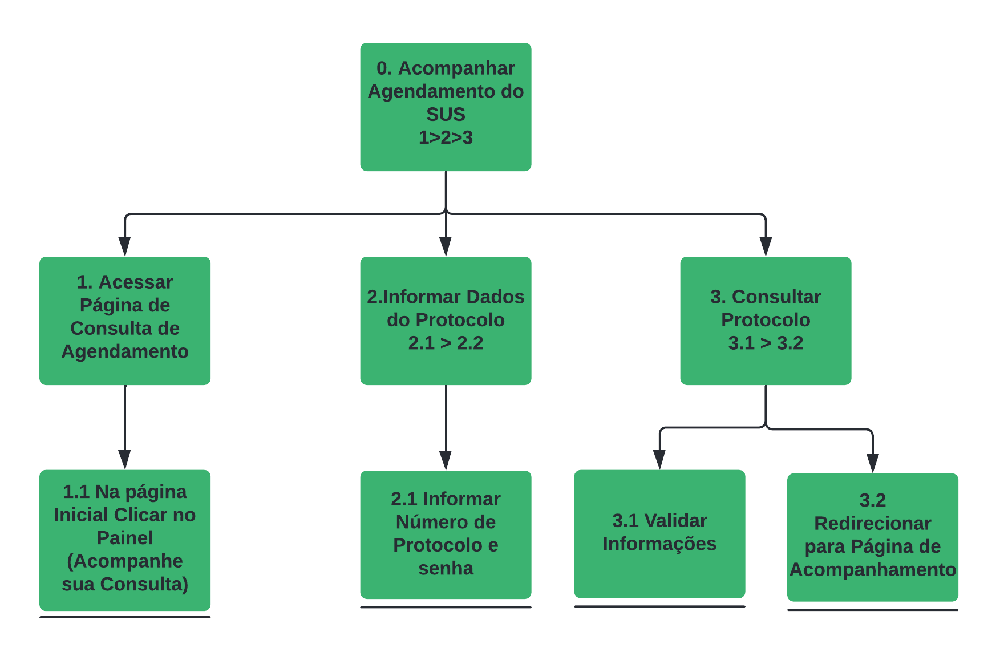

## 1. Introdução

A Análise Hierárquica de Tarefas compreende as competências e habilidades exibidas em tarefas complexas e não repetitivas, assim como ajuda identificar problemas de desempenho. Ela se baseia em psicologia funcional, e não comportamental, como as abordagens da época que foi criada. 
Toda tarefa é definida com o termo de seu(s) objetivo(s). Tarefas complexas são definidas em termos de objetivos e subobjetivos, em um desdobramento hierárquico. Esse desdobramento é chamado de decomposição de tarefas ou redescrição. Observe que a definição é mais ampla e difere da definição adotada pelo design baseado em objetivo. 
Um objetivo é um estado específico de coisa, um estado final. Esse estado pode ser definido por um ou mais eventos, ou por valores fisicamente observáveis de uma ou mais variáveis, que atuam como critério de alcance do objetivo. Em vez de identificar uma lista de ações, a HTA inicia com uma definição dos objetivos das pessoas.

 
## 2. Objetivo
 

Esta análise tem como objetivo, através do método de inspeção, identificar como os objetivos podem ser atingidos, dada o atual funcionamento e design do site. 
Os objetivos definidos das tarefas da análise que iremos analisar são:

-   Acompanhar o agendamento de consultas (SUS);
-   Entrar em contato com a Prefeitura.

Essas tarefas foram escolhidas com base nos <a href="https://interacao-humano-computador.github.io/2021.2-Prefeitura-Verdelandia/documentos/04-Planejamento-Avaliacao-Storyboard-Analise-tarefas/StoryBoard/Storyboard/"> Storyboards</a>.

## 3. Representação textual

A representação textual é um dos tipos de representação sugeridos por (Preece, Rogers e Sharp, 2005). Na notação textual, os itens de número zero representam os objetivos, os itens subsequentes são as tarefas e seus subitens representam sub tarefas.

### 3.1 Representação textual do objetivo de acompanhar o agendamento de consultas (SUS)

**0.** Acompanhar Consulta do SUS
 &emsp;&emsp;**1.** Acessar a página de acompanhamento de consulta
 &emsp;&emsp;&emsp;**1.1** Na página inicial, clicar no painel “Acompanhe aqui sua consulta”
 &emsp;&emsp;**2.** Informar dados do Protocolo
 &emsp;&emsp;&emsp;**2.1** Inserir número do protocolo e senha
 &emsp;&emsp;**3**. Consultar Protocolo
 &emsp;&emsp;&emsp;**3.1** Validar Dados do Protocolo
 &emsp;&emsp;&emsp;**3.2** Redirecionar para página de consulta (SUS)

### 3.2 Representação textual do objetivo de entrar em contato com a Prefeitura de Verdelândia

**0.** Entrar em contato com a Prefeitura de Verdelândia
 &emsp;&emsp;**1**. Acessar a página de Fale Conosco
 &emsp;&emsp;&emsp;**1.1** Na página inicial clique em “Fale conosco”.
 &emsp;&emsp;**2**. Preencher as informações para o envio da mensagem
 &emsp;&emsp;&emsp;**2.1** Preencher o campo "nome"
 &emsp;&emsp;&emsp;**2.2** Preencher o campo "email"
 &emsp;&emsp;&emsp;**2.3** Preencher o campo "como podemos ajudar?"
 &emsp;&emsp;&emsp;**2.4** Preencher o campo "mensagem"
 &emsp;&emsp;**3.** Enviar a mensagem
 &emsp;&emsp;&emsp;**3.1** Clicar em “Enviar Mensagem”

## 4. Representação gráfica

A notação gráfica para a Análise Hierárquica de Tarefas tem como base os autores Preece e Rogers (2005), sua estrutura é formada por retângulos, que representam tarefas e subtarefas, e as linhas a relação hierárquica entre as tarefas. Os planos de cada tarefa são descritos junto à linha vertical, logo abaixo do retângulo que contém a tarefa de forma decomposta.

### 4.1 Representação gráfica do objetivo de acompanhar o agendamento de consultas (SUS)

  <b>Figura 1: Representação gráfica do objetivo de acompanhar o agendamento de consultas (SUS).<b>
  
  
<b>Fonte: Elaboração Própria</b>

 

<b>Tabela 1: Problemas e acompanhar o agendamento de consultas (SUS)</b>

| Objetivos/ operações | Problemas e recomendações |
|:--------------------|:-------------------------|
| 0. Acompanhar Consulta do SUS | |
| 1. Acessar a página de acompanhamento de consulta | **Input**: Página inicial do site; **Action**: Clicar no painel "Acompanhe aqui sua consulta"; **Feedback**: Será redirecionado para a página de acompanhamento de consulta; **Recomendações**: O painel de que redireciona para o acompanhamento de consulta poderia estar em um local mais acessível na página, e ser mais minimalista.|
| 1.1 Na página inicial, clicar no painel “Acompanhe aqui sua consulta” | |
| 2. Informar dados do Protocolo | **Input**: Campos de texto para o número do protocolo e senha; **Action**: Preencher o número do protocolo e senha.  |
| 2.1 Inserir número do protocolo e senha | |
| 3. Consultar Protocolo | **Input**: Dados de protocolo; **Feedback**: Caso os dados estejam corretos, será redirecionado para a página de acompanhamento de consulta (SUS);**Action**: Clicar em "Entrar"|
| 3.1 Validar Dados do Protocolo | | |
| 3.2 Redirecionar para página de consulta (SUS) | |

<b>Fonte: Elaboração própria<b>

 
### 4.2 Representação gráfica do objetivo de entrar em contato com a Prefeitura de Verdelândia
 

  <b>Figura 2: Representação gráfica do objetivo de entrar em contato com a Prefeitura de Verdelândia.<b>
  
  
<b>Fonte: Elaboração própria</b>
 

 

<b>Tabela 2: Problemas e recomendações do objetivo de entrar em contato com a Prefeitura de Verdelândia</b>

| Objetivos/ operações                                                                                          | Problemas e recomendações                                                                                                                                                                                                                                                                                                                                                                                                                                                                                                                                                                                                                                                                                                                                                                               |
| :------------------------------------------------------------------------------------------------------------ | :------------------------------------------------------------------------------------------------------------------------------------------------------------------------------------------------------------------------------------------------------------------------------------------------------------------------------------------------------------------------------------------------------------------------------------------------------------------------------------------------------------------------------------------------------------------------------------------------------------------------------------------------------------------------------------------------------------------------------------------------------------------------------------------------------ |
| 0. Agendar empréstimo                                                                                         |                                                                                                                                                                                                                                                                                                                                                                                                                                                                                                                                                                                                                                                                                                                                                                                                         |
| 1. Acessar a página de "Fale Conosco" da Prefeitura de Verdelândia                                            | **Input**: Página inicial do site; **Action**: Clicar em "Fale conosco"; **Feedback**: Será redirecionado para a página do Fale Conosco; **Recomendações**: Arrumar o redirecionamento do "Fale Conosco pelo ESIC" presente no rodapé do <i>website</i>                                                                                                                                                                                                                                                                                                                                                                                                                                                                                                                                        |
| 1.1 Na página inicial clique em “Fale conosco", presente na barra de navegação ou no rodapé do <i>website</i> |                                                                                                                                                                                                                                                                                                                                                                                                                                                                                                                                                                                                                                                                                                                                                                                                         |
| 2. Preencher e selecionar informações para a mensagem                                                         | **Input:** informação dos campos do formulário.                                                                                                                                                                                                                                                                                                                                                                                                                                                                                                                                                                                                                                                                                                                                                         |
| 2.1 Preencher o campo "Nome"                                                                                  |                                                                                                                                                                                                                                                                                                                                                                                                                                                                                                                                                                                                                                                                                                                                                                                                         |
| 2.2 Preencher o campo "Email"                                                                                 |                                                                                                                                                                                                                                                                                                                                                                                                                                                                                                                                                                                                                                                                                                                                                                                                         |
| 2.3 Preencher o campo "Como podemos ajudar?"                                                                  |                                                                                                                                                                                                                                                                                                                                                                                                                                                                                                                                                                                                                                                                                                                                                                                                         |
| 2.4 Preencher o campo da mensagem                                                                             |                                                                                                                                                                                                                                                                                                                                                                                                                                                                                                                                                                                                                                                                                                                                                                                                         |
| 3. Enviar a mensagem                                                                                          | **Input**: Informações sobre mensagem e dados pessoais; **Action**: Clicar em "Enviar solicitação"; **Feedback**: Caso o nome esteja preenchido: uma mensagem embaixo do formulário dizendo "Agradecemos a sua mensagem.", mas caso o nome não esteja preenchido: uma mensagem dizendo "Um ou mais campos possuem um erro. Verifique e tente novamente." e abaixo do campo do nome um texto em vermelho dizendo "O campo é obrigatório.". **Problema**: Apenas o nome e o email são dados como campos obrigatórios, e isso pode levar o usuário a enviar uma mensagem com o nome e email, porém com o campo de mensagem ou assunto vazios. **Recomendações**: Fazer dos demais campos obrigatórios, e mostrar uma mensagem de erro caso algum desses campos obrigatórios estejam em branco. |
| 3.1 Clicar em “Enviar Mensagem”                                                                               |                                                                                                                                                                                                                                                                                                                                                                                                                                                                                                                                                                                                                                                                                                                                                                                                         |

<b>Fonte: Elaboração própria</b>

 
## 5. Referências
 
> BARBOSA, Simone; DINIZ, Bruno. Interação Humano-Computador, Rio de Janeiro, 2021.
 
> Preece, J.; Rogers, Y,; Sharp, H. Design de Interação. Porto ALegre: Bookman, 2005.
 
## 6. Histórico de versionamento
 
| Data  | Versão | Descrição | Autor | Revisor |
| :--:  | :----: | :-------: | :---: | :-----: |
| 25/02 | 1.0.0  | Criação do documento Representação Gráfica de Tarefas | [Rodrigo Carvalho](https://github.com/Rocsantos) | [Antonio Igor](https://github.com/AntonioIgorCarvalho) , [Douglas Monteles](https://github.com/DouglasMonteles) e [Valderson Pontes](https://github.com/valdersonjr) |
| 26/02 | 1.0.1 | Removido Introdução da Página | [Rodrigo Carvalho](https://github.com/Rocsantos) | [Antonio Igor](https://github.com/AntonioIgorCarvalho) , [Douglas Monteles](https://github.com/DouglasMonteles) e [Valderson Pontes](https://github.com/valdersonjr)
| 26/02 | 1.1.0 | Adicionado Representação Gráfica HTA | [Rodrigo Carvalho](https://github.com/Rocsantos) e [Eliseu Kadesh](https://github.com/eliseukadesh67) | [Antonio Igor](https://github.com/AntonioIgorCarvalho) , [Douglas Monteles](https://github.com/DouglasMonteles) e [Valderson Pontes](https://github.com/valdersonjr) |
| 26/02 | 1.2.0 | Adicionando Representação textual e mais detalhamentos | [Rodrigo Carvalho](https://github.com/Rocsantos) e [Eliseu Kadesh](https://github.com/eliseukadesh67) | [Antonio Igor](https://github.com/AntonioIgorCarvalho) , [Douglas Monteles](https://github.com/DouglasMonteles) e [ValdersonPontes](https://github.com/valdersonjr) |
| 26/02 | 1.2.1 | Alterando Legenda das Imagens | [Rodrigo Carvalho](https://github.com/Rocsantos) e [EliseuKadesh](https://github.com/eliseukadesh67) | [Antonio Igor](https://github.com/AntonioIgorCarvalho) , [Douglas Monteles](https://github.com/DouglasMonteles) e [Valderson Pontes](https://github.com/valdersonjr) |
| 30/03 | 1.3.0  |        Atualização da segunda tarefa        | [Antonio Igor](https://github.com/AntonioIgorCarvalho) e [Valderson Pontes](https://github.com/valdersonjr) | [Erick Levy](https://github.com/ErickLevy)
| 04/04 | 1.3.1  |        Atualização na descrição do documento        | [Antonio Igor](https://github.com/AntonioIgorCarvalho) | [Erick Levy](https://github.com/ErickLevy)
