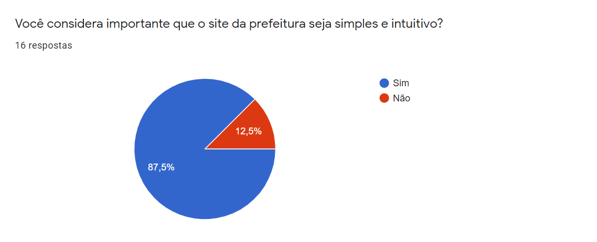

# Perfil do Usuário

## 1. Introdução

O processo para conhecer os usuários inicia-se com o levantamento do perfil destes usuários que utilizam o sistema. Dessa forma, conseguimos  entender melhor quem irá consumir o produto e quais são as suas necessidades, assim como poderemos selecionar um conjunto razoável de pessoas aptas a opinarem sobre a solução proposta.

A elaboração de um perfil de usuário é um processo iterativo. Em geral, um designer começa seu trabalho com uma ideia inicial de quem são seus usuários, mas essa ideia não costuma ser suficientemente detalhada e pode até ser apenas uma impressão equivocada. <strong>Barbosa, 2021</strong> [1].

## 2. Objetivos

Um questionário é um formulário impresso ou on-line com perguntas que os usuários e demais participantes devem responder , também é uma maneira de otimizar o entendimento do processo. É uma técnica que permite a rápida obtenção de informações quantitativas e qualitativas de um público alvo. Diferente da técnica de entrevista, o questionário permite coletar dados de pessoas até dispersas geograficamente.

## 3. Questionário

A fim de obter as características do perfil de usuário que usam sites relacionados a prefeituras, foi elaborado um questionário composto por questões que objetivam coletar dados que permitam identificar os traços do usuário, tais como o seu nível de instrução, sua faixa etária, sua experiência com o assunto abordado, etc.

O questionário foi criado a partir do Google Forms, aplicado de forma on-line e respondido mantendo o anonimato do respondente. Abaixo estão o resultado das questões aplicadas que servirão para facilitar a criação das personas. 

Aplicamos o questionário em forma online em plataformas como facebook,Linkedin,Whatsapp e Telegram para conseguir uma maior resposta dos usuários.

## 4. Comunidade

A comunidade que respondeu este questionario foram pessoas entre a faixa etaria de 18 a 31 anos que possuem acesso a internet, mas que consideram que um site de prefeitura seja simples e intuito assim sendo facil de utilizar.

## 5. Resultado das Questões

Abaixo estão as questões e o seu respectivo resultado após a divulgação do questionário. No total foram obtidas 16 (dezesseis) respostas e o seu resultado está em forma de gráfico para uma melhor visualização e para facilitar durante a análise dos dados.

  Para uma melhor visualização, acesse a página de resultados abaixo: 
  <a 
    href="https://docs.google.com/forms/d/e/1FAIpQLSfqoVUp4nTVp1ln7KuBrs_9aZVZVepZH7CB_RkJLiO0OVF0AQ/viewanalytics"
    target="_blanck"
  >  
    <strong>Clique aqui e veja o resultado do questionário.</strong>
  </a>

### 5.1 <a href="https://docs.google.com/forms/d/e/1FAIpQLSfqoVUp4nTVp1ln7KuBrs_9aZVZVepZH7CB_RkJLiO0OVF0AQ/viewanalytics"> Questão 1 </a>

<figure>
  
  <figcaption>Figura 1: Questão 1</figcaption>
</figure>

### 5.2 <a href="https://docs.google.com/forms/d/e/1FAIpQLSfqoVUp4nTVp1ln7KuBrs_9aZVZVepZH7CB_RkJLiO0OVF0AQ/viewanalytics"> Questão 2 </a>

<figure>
  
  <figcaption>Figura 2: Questão 2</figcaption>
</figure>

### 5.3 <a href="https://docs.google.com/forms/d/e/1FAIpQLSfqoVUp4nTVp1ln7KuBrs_9aZVZVepZH7CB_RkJLiO0OVF0AQ/viewanalytics"> Questão 3 </a>

<figure>
  
  <figcaption>Figura 3: Questão 3</figcaption>
</figure>

### 5.4 <a href="https://docs.google.com/forms/d/e/1FAIpQLSfqoVUp4nTVp1ln7KuBrs_9aZVZVepZH7CB_RkJLiO0OVF0AQ/viewanalytics"> Questão 4 </a>

<figure>
  
  <figcaption>Figura 4: Questão 4</figcaption>
</figure>

### 4.5 <a href="https://docs.google.com/forms/d/e/1FAIpQLSfqoVUp4nTVp1ln7KuBrs_9aZVZVepZH7CB_RkJLiO0OVF0AQ/viewanalytics"> Questão 5 </a>

<figure>
  
  <figcaption>Figura 5: Questão 5</figcaption>
</figure>

### 5.6 <a href="https://docs.google.com/forms/d/e/1FAIpQLSfqoVUp4nTVp1ln7KuBrs_9aZVZVepZH7CB_RkJLiO0OVF0AQ/viewanalytics"> Questão 6 </a>

<figure>
  
  <figcaption>Figura 6: Questão 6</figcaption>
</figure>

### 5.7 <a href="https://docs.google.com/forms/d/e/1FAIpQLSfqoVUp4nTVp1ln7KuBrs_9aZVZVepZH7CB_RkJLiO0OVF0AQ/viewanalytics"> Questão 7 </a>

<figure>
  
  <figcaption>Figura 7: Questão 7</figcaption>
</figure>

### 5.8 <a href="https://docs.google.com/forms/d/e/1FAIpQLSfqoVUp4nTVp1ln7KuBrs_9aZVZVepZH7CB_RkJLiO0OVF0AQ/viewanalytics"> Questão 8 </a>

<figure>
  
  <figcaption>Figura 8: Questão 8</figcaption>
</figure>

## 6. Perguntas obtidas com o questionário do porque o uso do site de prefeitura

As perguntas foram ordenadas de acordo com o percentual de sua importância para os usuários que responderam a questão 5.8, também foi analizado que a grande maioria das pessoas conseguiram atingir seus objetivos de acordo com a questão 5.7.

-   Para acompanhar as notícias da minha cidade.
-   Para saber mais sobre o passado da cidade.
-   Para me informar sobre ações sociais em andamento na cidade.
-   Para me informar sobre ou solicitar os serviços de limpeza e iluminação pública.
-   Para me informar sobre os serviços de transporte urbano.
-   Para saber sobre o CRAS.
-   Para saber ou acompanhar as vagas na educação infantil e o ensino fundamental.
-   Atividades relacionadas ao fluxo de emissão e consulta de notas fiscais eletrônicas.

## 7. Conclusão

Em posse dos dados obtidos com a aplicação do questionário, podemos perceber que o público mais assíduo encontra-se na faixa de 18 à 22 anos, ou seja, trata-se de usuários jovens que já completaram o ensino superior ou ainda o  estão cursando e que não possuem dificuldade em utilizar-se da tecnologia.

Além disso, observa-se que a grande maioria dos usuários exigem simplicidade e intuitividade nos sites das prefeituras que acessam ou já precisaram acessar em algum momento. Concomitante a isso, ao menos 38.5% julgaram ter tido uma experiência ruim ao acessar o site de alguma prefeitura. Apesar os inconvenientes, a maioria dos respondentes conseguiram atingir o seu objetivo ao acessar o site, e dentre os principais motivos para acessa-lo estão: Acompanhar as notícias de sua respectiva cidade, obter informações sobre o transporte urbano e matrículas em educação infantil. 

## 8. Referências

> [1] Barbosa, S. D. J.; Silva, B. S. da; Silveira, M. S.; Gasparini, I.; Darin, T.; Barbosa, G. D. J. (2021) Interação HumanoComputador e Experiência do usuário. Autopublicação.

> [2] Vazquez, Carlos E. Engenharia de requisitos software orientado a negocios. Rio de Janeiro. Ed. Abreu’s System, 2016

## 9. Histórico de versionamento

| Data  | Versão |                      Descrição                       |                                                Autor                                                |                                                   Revisor                                                   |
| :---: | :----: | :--------------------------------------------------: | :-------------------------------------------------------------------------------------------------: | :---------------------------------------------------------------------------------------------------------: |
| 24/02 | 1.0.0  |      Criação do documento de Perfil do Usuário       | [Douglas Monteles](https://github.com/DouglasMonteles) e [Erick Levy](https://github.com/ErickLevy) | [Antonio Igor](https://github.com/antonioigorcarvalho) e [Eliseu Kadesh](https://github.com/eliseukadesh67) |
| 24/02 | 1.1.0  |     Completando a introdução com dados do livro      | [Douglas Monteles](https://github.com/DouglasMonteles) e [Erick Levy](https://github.com/ErickLevy) | [Antonio Igor](https://github.com/antonioigorcarvalho) e [Eliseu Kadesh](https://github.com/eliseukadesh67) |
| 24/02 | 1.2.0  |    Criando a definição do tópico de questionário     | [Douglas Monteles](https://github.com/DouglasMonteles) e [Erick Levy](https://github.com/ErickLevy) | [Antonio Igor](https://github.com/antonioigorcarvalho) e [Eliseu Kadesh](https://github.com/eliseukadesh67) |
| 24/02 | 1.3.0  |            Adicionando coluna de revisor             | [Douglas Monteles](https://github.com/DouglasMonteles) e [Erick Levy](https://github.com/ErickLevy) | [Antonio Igor](https://github.com/antonioigorcarvalho) e [Eliseu Kadesh](https://github.com/eliseukadesh67) |
| 25/02 | 1.4.0  | Adicionando as questões e resultados do questionário | [Douglas Monteles](https://github.com/DouglasMonteles) e [Erick Levy](https://github.com/ErickLevy) | [Antonio Igor](https://github.com/antonioigorcarvalho) e [Eliseu Kadesh](https://github.com/eliseukadesh67) |
| 06/04 | 1.5.0  |                Melhorias no documento                |                             [Erick Levy](https://github.com/ErickLevy)                              |                           [Antonio Igor](https://github.com/antonioigorcarvalho)                            |
