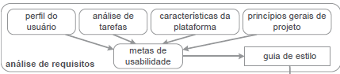
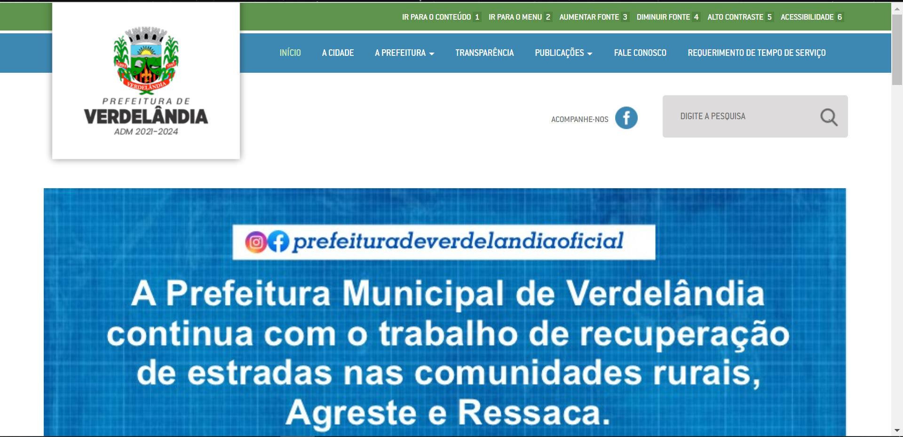
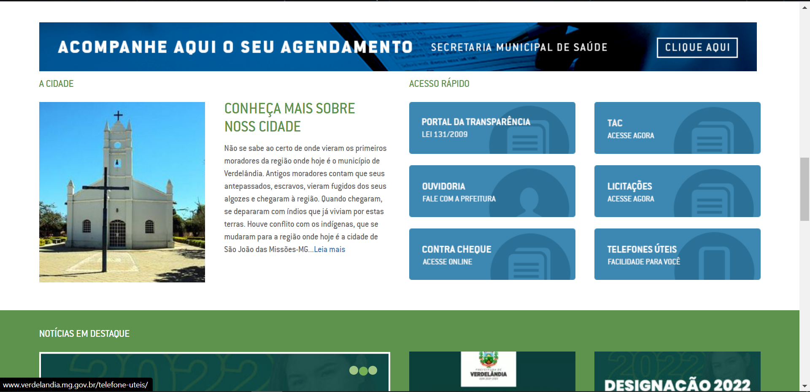
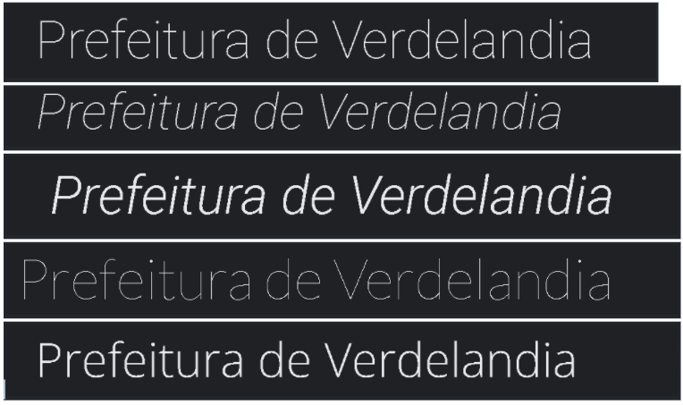

## 1. Introdução
 

    O guia de estilo é um registro das decisões tomadas pelo design no qual elas não se percam e sejam inseridas no produto final,também é importante que as decisões tomadas pelo design sejam consultadas e utilizadas segundo Barbosa (2021).
    O guia de estilo pode ser elaborado com diferentes escopos: plataforma, corporativo, família de produtos e um produto específico.
    Portanto, sempre deve ser elaborado com base nas metas de usabilidade.  

  <figcaption>Figura 1: Guia de estilo</figcaption>

  

  <figcaption>Fonte: BARBOSA, 2021</figcaption>

 
## 2. Objetivo

  O Guia de Estilos deve ser o documento que estabelece uma comunicação entre os membros da equipe responsáveis pelo design do sistema e também com a equipe de desenvolvimento. Dessa forma, neste documento devem constar todas as decisões de design e estas devem ser claras e de fácil acesso para futuras consultas acerca das versões futuras do produto.

## 3. Estrutura

  A fim de elaboração do Guia de Estilos, decidimos adotar a seguinte  estrutura proposta por [1] Marcus, 1991; [2] Mayhew, 1999.

1. Introdução
      - Objetivo do guia de estilo
      - Organização e conteúdo do guia de estilo
      - Público-alvo do guia de estilos (programadores, gerentes, equipe de suporte)
      - Como utilizar o guia (em produção e manutenção)
      - Como manter o guia
2. Resultados de análise
      - Descrição do ambiente de trabalho do usuário
3. Elementos de interface
      - Disposição espacial e grid
      - Janelas
      - Tipografia
      - Símbolos não tipográficos
      - Cores
      - Animações
4. Elementos de interação
      - Estilos de interação
      - Seleção de um estilo
      - Aceleradores (teclas de atalho)
5. Elementos de ação
      - Preenchimento de campos
      - Seleção
      - Ativação
6. Vocabulário e padrões
      - Terminologia
      - Tipos de tela (para tarefas comuns)
      - Sequências de diálogos (e.g., para feedback ou confirmação de uma operação)
 
## 4. Público-alvo do guia de estilos

      O guia de estilo tem como público alvo as equipes de desenvolvimento e design.

## 5. Como utilizar o guia

  O guia de estilo durante o decorrer do projeto deverá ser usado como um padrão a ser seguido pelo design para ajudar a equipe de desenvolvimento neste projeto do site Prefeitura de Verdelândia, segundo o Ciclo de vida de Mayhew.

## 6. Como manter o guia

     O guia de estilo deve seguir as alterações necessárias sempre que o projeto precisar, assim deve ser atualizado de acordo com essas alterações.

 

## 7. Resultados de análise

  O ambiente de trabalho do usuário consiste no site da Prefeitura de Verdelândia, que dispõe de 7 (sete) funcionalidades no menu principal relacionadas aos interesses públicos, como emissão de tempo de serviço, acesso a relatórios e as leis anuais. Além disso, também é foco do site exibir notícias relacionadas a cidade e as ações ou trabalhos promovidos pela prefeitura, sendo essas notícias separadas em algumas seções dentro do site. Também é foco do site tratar das questões relacionadas à acessibilidade, conforme os padrões estabelecidos pela W3C.

  Abaixo segue a captura de algumas partes da tela inicial do site da Prefeitura de Verdelândia.

<figure>
  <figcaption>
    Figura 2: Tela inicial do site da prefeitura de Verdelândia com pop-up
  </figcaption>
  
  <figcaption>
    Fonte: <a href="http://www.verdelandia.mg.gov.br" target="_blanck">Site da Prefeitura de Verdelândia</a>
  </figcaption>
</figure>

<figure>
  <figcaption>
    Figura 3: Tela inicial do site da prefeitura de Verdelandia sem pop-up
  </figcaption>
  
  <figcaption>
    Fonte: <a href="http://www.verdelandia.mg.gov.br" target="_blanck">Site da Prefeitura de Verdelândia</a>
  </figcaption>
</figure>

<figure>
  <figcaption>
    Figura 4: Menu de acesso rápido na tela inicial
  </figcaption>
  
  <figcaption>
    Fonte: <a href="http://www.verdelandia.mg.gov.br" target="_blanck">Site da Prefeitura de Verdelândia</a>
  </figcaption>
</figure>

## 8. Elementos de interface

### 8.1 Disposição espacial e grid

  <figcaption>Figura 5: Grid da tela inicial</figcaption>

  

  <figcaption>Fonte: Elaboração Própria</figcaption>

### 8.2 Janelas

  
      O site é composto por 12 páginas que compõem o grid e estas janelas são:

- INÍCIO
- A CIDADE
- A PREFEITURA
  - TELEFONE ÚTEIS
- TRANSPARÊNCIA
-  PUBLICAÇÕES
   - BALANCETES
   - CONVÊNIOS
   - DECRETOS
   - LEIS
   - PORTARIAS
- FALE CONOSCO 

### 8.3 Tipografia

  Os textos presentes, utilizam as fontes Sans serif e Lato.

  <figcaption>Figura 6: Fontes utilizadas</figcaption>

  
  
  <figcaption>Fonte: Elaboração Própria</figcaption>

### 8.4 Símbolos não tipográficos

  O site  não possui nenhum símbolo não tipográfico.

### 8.5 Cores

  Abaixo estão as cores principais e secundárias identificadas no site da Prefeitura de Verdelândia, bem como as cores do <a href="../../../assets/guia/brasao-pref-verdelandia.png" target="_blanck">brasão</a> presente na bandeira da cidade, o qual também é a logo do site.

<figure>
  <figcaption>Figura 7: Cores principais</figcaption>
  

    

      

      
        <strong>#5d934c</strong>
      
    

    

      

      
        <strong>#337ab7</strong>
      
    

    

      

      
        <strong>#3d88b2</strong>
      
    

    

      

      
        <strong>#999</strong>
      
    

    

      

      
        <strong>#f1f1f1</strong>
      
    

  

  <figcaption>Fonte: Elaboração Própria</figcaption>
</figure>

<figure>
  <figcaption>Figura 8: Cores Secundárias</figcaption>
  

    

      

      
        <strong>#f7e700</strong>
      
    

    

      

      
        <strong>#FF0000</strong>
      
    

    

      

      
        <strong>#398f14</strong>
      
    

    

      

      
        <strong>#5cb85c</strong>
      
    

  

  <figcaption>Fonte: Elaboração Própria</figcaption>
</figure>

<figure>
  <figcaption>Figura 9: Cores do 
    <a href="../../../assets/guia/brasao-pref-verdelandia.png" target="_blanck">Brasão da Prefeitura de Verdelândia</a>
  </figcaption>
  

    

      

      
        <strong>#009400</strong>
      
    

    

      

      
        <strong>#ff2f0c</strong>
      
    

    

      

      
        <strong>#ff8f1a</strong>
      
    

    

      

      
        <strong>#fff549</strong>
      
    

    

      

      
        <strong>#57ccee</strong>
      
    

    

      

      
        <strong>#ffffff</strong>
      
    

    

      

      
        <strong>#c6c8cb</strong>
      
    

    

      

      
        <strong>#000000</strong>
      
    

  

  <figcaption>Fonte: Elaboração Própria</figcaption>
</figure>

### 8.6 Animações

  A única animação presente no site e a animação de carrossel.

## 9. Elementos de interação

### 9.1 Estilos de interação

  Sobre os estilos de interação utilizados no site, podemos citar:

- A presença de menu superior comum a todas as telas;
- Linguagem simples (natural): O site se comunica com o usuário através de termos que são comuns no ambiente da prefeitura e que são de conhecimento do cidadão;
- O site apresenta o uso do WIMP (Acrônimo para Window Icon Menu Point device), que é um estilo de interação que utiliza estes elementos; 

### 9.2 Seleção de um estilo

  No site, o único estilo de utilização presente é o de ações dispostas em menus, sendo estes reforçados ou não com ícones.

### 9.3 Aceleradores (teclas de atalho)

  O site possui algumas teclas de atalho sendo informadas na página de acessibilidade, sendo estas teclas utilizadas para levar o usuário até as páginas especificadas na lista da Figura 4.

<figure>
  <figcaption>
    Figura 10: Teclas de atalho disponíveis no site da prefeitura de Verdelândia
  </figcaption>
  
  <figcaption>
    Fonte: <a href="http://www.verdelandia.mg.gov.br" target="_blanck">Site da Prefeitura de Verdelândia</a>
  </figcaption>
</figure>

## 10. Elementos de ação

### 10.1 Preenchimento de campos

  O site não possui campos a serem preenchidos.

### 10.2 Seleção

  Todos os elementos do site são selecionáveis, mas a maioria das imagens não funciona e redirecionam para o início do site.  

[Prefeitura de Verdelândia](http://www.verdelandia.mg.gov.br/)

### 10.3 Ativação

  O site não possui nenhuma ação na qual seja necessária a realização de ativação ou autenticação.

## 11. Vocabulário e padrões

### 11.1 Terminologia

  O site possui em sua grande maioria, termos que são comuns ao cotidiano dos usuários, que são os cidadãos da cidade de Verdelândia. No entanto, também é perceptível a presença de termos que são inerentes às áreas jurídicas e administrativas relacionadas ao meio da prefeitura da cidade. 

### 11.2  Tipos de tela (para tarefas comuns)

  Todas as telas do site possuem o mesmo padrão em sua estrutura, alterando somente o conteúdo a ser tratado por aquela tela e o indicador utilizado para informar ao usuário em qual página ele se encontra, mas mantendo toda a parte do cabeçalho e rodapé as mesmas.

<figure>
  <figcaption>
    Figura 11: Menu presente em todas as telas
  </figcaption>
  
  <figcaption>
    Fonte: <a href="http://www.verdelandia.mg.gov.br" target="_blanck">Site da Prefeitura de Verdelândia</a>
  </figcaption>
</figure>

<figure>
  <figcaption>
    Figura 12: Indicador de página
  </figcaption>
  
  <figcaption>
    Fonte: <a href="http://www.verdelandia.mg.gov.br" target="_blanck">Site da Prefeitura de Verdelândia</a>
  </figcaption>
</figure>

<figure>
  <figcaption>
    Figura 13: Rodapé presente em todas as telas
  </figcaption>
  
  <figcaption>
    Fonte: <a href="http://www.verdelandia.mg.gov.br" target="_blanck">Site da Prefeitura de Verdelândia</a>
  </figcaption>
</figure>

### 11.3  Sequências de diálogos 

  Foi identificado somente a sequência de diálogos presente na página de Fale Conosco, que possui um formulário para o envio de mensagens o qual emite dois tipos de diálogo: Aviso e Sucesso, referentes a ação de enviar os dados do formulário. 

<figure>
  <figcaption>
    Figura 14: Diálogo de aviso
  </figcaption>
  
  <figcaption>
    Fonte: <a href="http://www.verdelandia.mg.gov.br" target="_blanck">Site da Prefeitura de Verdelândia</a>
  </figcaption>
</figure>

<figure>
  <figcaption>
    Figura 15: Diálogo de sucesso
  </figcaption>
  
  <figcaption>
    Fonte: <a href="http://www.verdelandia.mg.gov.br" target="_blanck">Site da Prefeitura de Verdelândia</a>
  </figcaption>
</figure>

## 12. Referências
 
> BARBOSA, Simone; DINIZ, Bruno. Interação Humano-Computador, Rio de Janeiro, 2021.

> [1] Marcus, Aaron (1991). Graphic design for electronic documents and user interfaces. Association for Computing Machinery, New York, NY, USA.

> [2] Mayhew, Deborah J. (1999). The Usability Engineering Lifecycle: A Practitioner’s Handbook for User Interface Design. Morgan Kaufmann, 1st edition edition.
 
## 13. Histórico de versionamento
 
| Data  | Versão |                Descrição                |                                                Autor                                                | Revisor |
| :---: | :----: | :-------------------------------------: | :-------------------------------------------------------------------------------------------------: | :-----: |
| 10/03 | 1.0.0  | Criação do documento de Guia de Estilos | [Douglas Monteles](https://github.com/DouglasMonteles) e [Erick Levy](https://github.com/ErickLevy) | [Antonio Igor](https://github.com/antonioigorcarvalho), [Eliseu Kadesh](https://github.com/eliseukadesh67) e [Rodrigo Carvalho](https://github.com/Rocsantos) |
| 12/03 | 1.0.1  | Alterando a posição das legendas das figuras e adicionando a fonte | [Douglas Monteles](https://github.com/DouglasMonteles) e [Erick Levy](https://github.com/ErickLevy) | [Antonio Igor](https://github.com/antonioigorcarvalho), [Eliseu Kadesh](https://github.com/eliseukadesh67) e [Rodrigo Carvalho](https://github.com/Rocsantos) |
