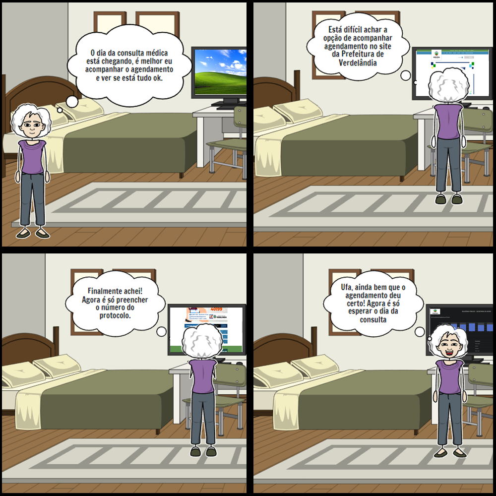
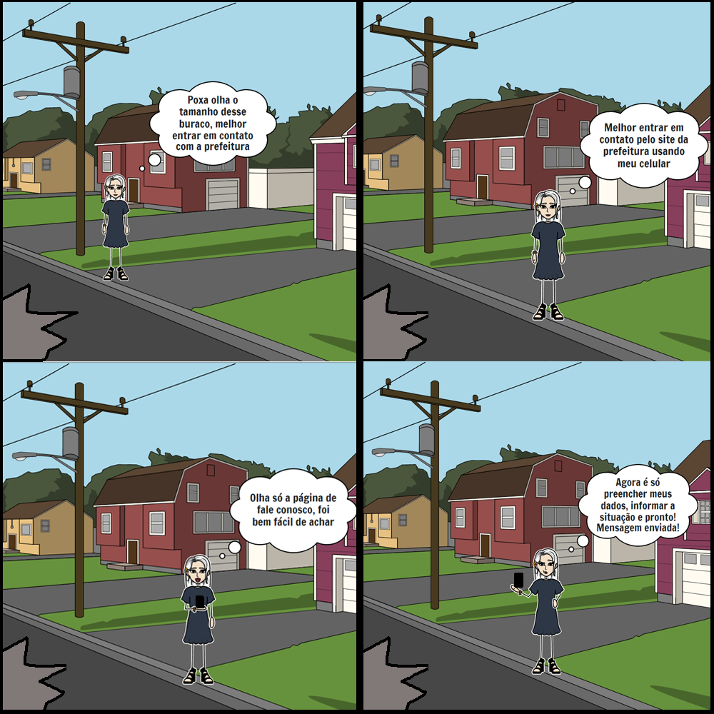

# Storyboard

## 1. Introdução

### 1.1 Protótipos de baixa fidelidade

Um storyboard é classificado como um tipo de protótipo de baixa fidelidade, esses protótipos tem a finalidade de propor uma base, ainda que distante, do produto final, a vantagem é que esse tipo de protótipo pode ser construído rapidamente, permitindo a realização de alterações com facilidade. 

### 1.2 Storyboard

No caso do storyboard, ele é formado por diversos desenhos que ilustrarão como um usuário poderá progredir em uma tarefa ao utilizar o sistema definido, no caso tarefas do site da Prefeitura de Verdelândia. Assim trazendo uma noção mais clara sobre as tarefas do sistema.

## 2. Metodologia 

A partir da análise das do documento de Análise Hierárquica de Tarefas (AHT) tarefas que serão utilizadas para a criação do storyboard foram selecionadas. Para cada tarefa selecionada uma persona compatível foi selecionada para ser a protagonista de cada storyboard.

As ferramentas utilizadas para elaborar os storyboards foram: 

- <a href="https://www.storyboardthat.com/pt" target="_blanck">Storyboardthat</a>
- Adobe Photoshop

## 3. Storyboards

### 3.1 Acompanhar o agendamento de consultas (SUS)

| Nome  | Idade | Profissão | Objetivo | Expectativa |
| :--:  | :---: | :-------: | :------: | :---------: |
| Camila Gomes Ribeiro | 83 | Professora aposentada | Deseja acessar o site da Prefeitura de Verdelândia e acompanhar o agendamento de sua consulta | Ela espera ver de forma fácil, objetiva e resumida como está o agendamento de sua consulta |

Camila Gomes é uma professora aposentada, após sentir dores em seu abdômen ela decidiu agendar uma consultar pelo SUS, após solicitar uma consulta e receber um número de protocolo da secretaria da saúde de seu município ela foi orientada a acompanhar o agendamento pelo site da Prefeitura de Verdelândia, como possui um computador em sua casa ela decide realizar o procedimento.

<figure>
  <figcaption>
    Figura 1: Storyboard acompanhar agendamento de consultas (SUS)
  </figcaption>
  
  <figcaption>
    Fonte: Dos autores
  </figcaption>
</figure>

### 3.2 Entrar em contato com a ouvidoria de Verdelândia

| Nome | Idade | Profissão | Objetivo | Expectativa |
| :--: | :---: | :-------: | :------: | :---------: |
| Lara Barros Cavalcanti | 27 | Dona de casa | Deseja acessar o site da Prefeitura de Verdelândia para reportar um problema de infraestrutura | Contatar a Prefeitura de Verdelândia |

Lara Barros é uma dona de casa, as vezes no período da tarde ela gosta de passear pela cidade, durante uma das suas caminhadas ela encontra um grande buraco no asfalto de sua rua, ela pega seu celular e decide entrar no site da Prefeitura de Verdelândia para informar sobre o problema de insfraestrutura.

<figure>
  <figcaption>
    Figura 2: Storyboard entrar em contato com a ouvidoria de Verdelândia
  </figcaption>
  
  <figcaption>
    Fonte: Dos autores
  </figcaption>
</figure>

## 4. Conclusão

Então concluímos que a partir desse documento podemos ter uma visão mais completa das tarefas que foram levantadas no documento de Análise Hierárquica de Tarefas (AHT), percebemos pelo storyboard o motivo que levou a persona acessar o site da Prefeitura de Verdelândia, em qual ambiente ela estava, quais os dispositivos disponíveis, tudo de forma resumida e de fácil entendimento.

## 5. Referências

> Preece, J.; Rogers, Y.; Sharp, H.; Design de Interação. Além da Interação Homem-Computador.

## 6. Histórico de versionamento
 
| Data  | Versão | Descrição | Autor | Revisor |
| :--:  | :----: | :-------: | :---: | :-----: |
| 14/03 | 1.0.0 | Criação do documento de storyboard | [Antonio Igor](https://github.com/antonioigorcarvalho) e [Valderson Pontes](https://github.com/valdersonjr) | - |
| 15/03 | 1.0.1 | Inclusão das personas nos storyboards | [Antonio Igor](https://github.com/antonioigorcarvalho) e [Valderson Pontes](https://github.com/valdersonjr) | - |