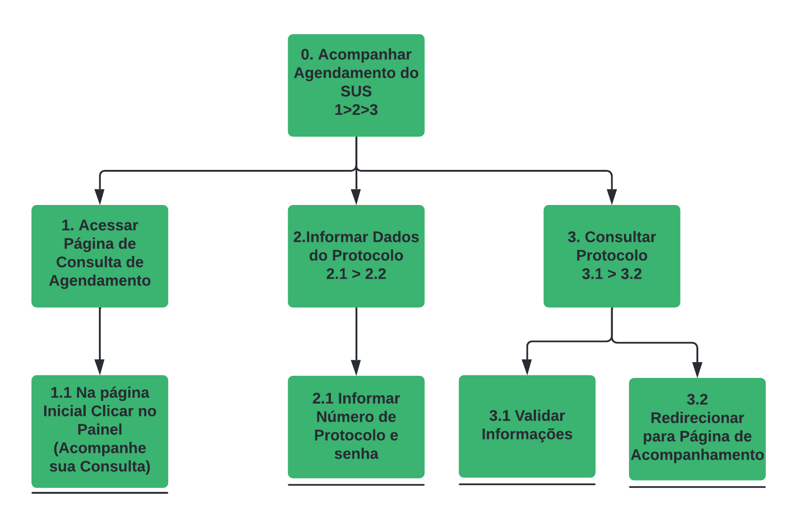

## 1. Introdução
 

A Análise Hierárquica de Tarefas compreende as competências e habilidades exibidas em tarefas complexas e não repetitivas, assim como ajuda identificar problemas de desempenho. Ela se baseia em psicologia funcional, e não comportamental, como as abordagens da época que foi criada. 
Toda tarefa é definida com o termo de seu(s) objetivo(s). Tarefas complexas são definidas em termos de objetivos e sub-objetivos, num desdobramento hierárquico. Esse desdobramento é chamado de decomposição de tarefas ou redescrição. Observer que a definição é mais ampla e difere da definição adotada pelo design baseado em objetivo. 
Um objetivo é um estado específico de coisa, um estado final. Esse estado pode ser definido por um ou mais eventos ou por valores fisicamente observáveis de uma ou mais variáveis, que atuam como critério de alcance do objetivo. Em vez de identificar uma lista de ações, a HTA inicia com uma definição dos objetivos das pessoas.

 
## 2. Objetivo
 

Esta análise tem como objetivo, através do método de inspeção, identificar como os objetivos podem ser atingidos, dada o atual funcionamento e design do site. 
Os objetivos definidos das tarefas da análise que iremos analisar são:

- Acompanhar o agendamento de consultas (SUS);
- Entrar em contato com a ouvidoria da Prefeitura

## 3. Representação textual

A representação textual é um dos tipos de representação sugeridos por (Preece, Rogers e Sharp, 2005). Na notação textual, os itens de número zero representam os objetivos, os itens subsequentes são as tarefas e seus subitens representam sub tarefas.

### 3.1 Representação textual do objetivo de acompanhar o agendamento de consultas (SUS)

**0.** Acompanhar Consulta do SUS
 &emsp;&emsp;**1.** Acessar a página de acompanhamento de consulta
 &emsp;&emsp;&emsp;**1.1** Na página inicial, clicar no painel “Acompanhe aqui sua consulta”
 &emsp;&emsp;**2.** Informar dados do Protocolo
 &emsp;&emsp;&emsp;**2.1** Inserir número do protocolo e senha
 &emsp;&emsp;**3**. Consultar Protocolo
 &emsp;&emsp;&emsp;**3.1** Validar Dados do Protocolo
 &emsp;&emsp;&emsp;**3.2** Redireccionar para página de consulta (SUS)

### 3.2 Representação textual do objetivo de entrar em contato com a ouvidoria de Verdelândia

**0.** Entrar em contato com a ouvidoria da Prefeitura
 &emsp;&emsp;**1**. Acessar a página da ouvidoria
 &emsp;&emsp;&emsp;**1.1** Na página inicial clique em “Fale conosco”.
 &emsp;&emsp;&emsp;**1.2** Clicar em “Ouvidoria” na aba de “Links Úteis"
 &emsp;&emsp;**2**. Preencher e selecionar informações para a mensagem
 &emsp;&emsp;&emsp;**2.1** Selecionar a secretaria ou órgão
 &emsp;&emsp;&emsp;**2.2** Selecionar o assunto
 &emsp;&emsp;&emsp;**2.3** Preencher dados pessoais (nome completo, telefone, email, endereço completo)
 &emsp;&emsp;&emsp;**2.4** Preencher o campo da mensagem
 &emsp;&emsp;**3.** Enviar a mensagem
 &emsp;&emsp;&emsp;**3.1** Clicar em “Enviar solicitação”

## 4. Representação gráfica

A notação gráfica para a Análise Hierárquica de Tarefas tem como base os autores Preece e Rogers (2005), sua estrutura é formada por retângulos, que representam tarefas e subtarefas, e as linhas a relação hierárquica entre as tarefas. Os planos de cada tarefa são descritos junto à linha vertical, logo abaixo do retângulo que contém a tarefa de forma decomposta.

### 4.1 Representação gráfica do objetivo de acompanhar o agendamento de consultas (SUS)

  <b>Figura 1: Representação gráfica do objetivo de acompanhar o agendamento de consultas (SUS).<b>
  
  
<b>Fonte: Elaboração Própria</b>

 

<b>Tabela 1: Problemas e acompanhar o agendamento de consultas (SUS)</b>

| Objetivos/ operações | Problemas e recomendações |
|:--------------------|:-------------------------|
| 0. Acompanhar Consulta do SUS | |
| 1. Acessar a página de acompanhamento de consulta | **Input**: Página inicial do site; **Action**: Clicar no painel "Acompanhe aqui sua consulta"; **Feedback**: Será redirecionado para a página de acompanhamento de consulta; **Recomendações**: O painel de que redireciona para o acompanhamento de consulta poderia estar em um local mais acessivel na pagina, e ser mais minimalista.|
| 1.1 Na página inicial, clicar no painel “Acompanhe aqui sua consulta” | |
| 2. Informar dados do Protocolo | **Input**: Campos de texto para o número do protocolo e senha; **Action**: Preencher o número do protocolo e senha.  |
| 2.1 Inserir número do protocolo e senha | |
| 3. Consultar Protocolo | **Input**: Dados de protocolo; **Feedback**: Caso os dados estejam corretos, sera redirecionado para a página de acompanhamento de consulta (SUS);**Action**: Clicar em "Entrar"|
| 3.1 Validar Dados do Protocolo | | |
| 3.2 Redireccionar para página de consulta (SUS) | |

<b>Fonte: Elaboração própria<b>

 
### 4.2 Representação gráfica do objetivo de entrar em contato com a ouvidoria de Verdelândia
 

  <b>Figura 2: Representação gráfica do objetivo de entrar em contato com a ouvidoria de Verdelândia.<b>
  
  
<b>Fonte: Elaboração própria</b>
 

 

<b>Tabela 2: Problemas e recomendações do objetivo de entrar em contato com a ouvidoria de Verdelândia</b>

| Objetivos/ operações | Problemas e recomendações |
|:--------------------|:-------------------------|
| 0. Agendar empréstimo | |
| 1.  Acessar a página da ouvidoria | **Input**: Página inicial do site; **Action**: Clicar "Fale conosco" e depois clicar em "ouvidoria" na aba de "Links úteis"; **Feedback**: Será redirecionado para a página da ouvidoria; **Recomendações**: O link para a aba de links úteis poderia ser mais acessível, sem ter a necessidade de ter um passo a mais para acessá-la.|
| 1.1 Na página inicial clique em “Fale conosco | |
| 1.2 Clicar em “Ouvidoria” na aba de “Links Úteis"| |
| 2. Preencher e selecionar informações para a mensagem | **Input:** Seletores para secretaria/órgão e assunto e campos de texto para dados pessoais e mensagem |
| 2.1 Selecionar a secretaria ou órgão | |
| 2.2 Selecionar o assunto | |
| 2.3 Preencher dados pessoais (nome completo, telefone, email, endereço completo) | |
| 2.4 Preencher o campo da mensagem | |
| 3. Enviar a mensagem | **Input**: Informações sobre mensagem e dados pessoais; **Action**: Clicar em "Enviar solicitação"; **Feedback**: Caso o nome esteja preenchido: uma mensagem embaixo do formulário dizendo "Agradecemos a sua mensagem.", mas caso o nome não esteja preenchido: uma mensagem dizendo "Um ou mais campos possuem um erro. Verifique e tente novamente." e abaixo do campo do nome um texto em vermelho dizendo "O campo é obrigatório.". **Problema**: Apenas o nome é dado como um campo obrigatório, e isso pode levar o usuário a enviar uma mensagem apenas com o nome e com o campo de mensagem ou assunto vazios. **Recomendações**: Fazer dos demais campos obrigatórios, e mostrar uma mensagem de erro caso algum desses campos obrigatórios estejam em branco.|
| 3.1 Clicar em “Enviar solicitação”| |

<b>Fonte: Elaboração própria</b>

 
## Referências Bibliográficas
 
> BARBOSA, Simone; DINIZ, Bruno. Interação Humano-Computador, Rio de Janeiro, 2021.
 
> Preece, J.; Rogers, Y,; Sharp, H. Design de Interação. Porto ALegre: Bookman, 2005.
 
## Histórico de versionamento
 
| Data  | Versão | Descrição | Autor | Revisor |
| :--:  | :----: | :-------: | :---: | :-----: |
| 25/02 | 1.0.0  | Criação do documento Representação Gráfica de Tarefas | [Rodrigo](https://github.com/Rocsantos) | Definir |
| 26/02 | 1.0.1 | Removido Introdução da Página | [Rodrigo](https://github.com/Rocsantos) | Definir
| 26/02 | 1.1.0 | Adicionado Representação Gráfica HTA | [Rodrigo](https://github.com/Rocsantos) e [Eliseu](https://github.com/eliseukadesh67) | Definir |
| 26/02 | 1.2.0 | Adicionando Representação textual e mais detalhamentos | [Rodrigo](https://github.com/Rocsantos) e [Eliseu](https://github.com/eliseukadesh67) | Definir |
| 26/02 | 1.2.1 | Alterando Legenda das Imagens | [Rodrigo](https://github.com/Rocsantos) e [Eliseu](https://github.com/eliseukadesh67) | Definir |
